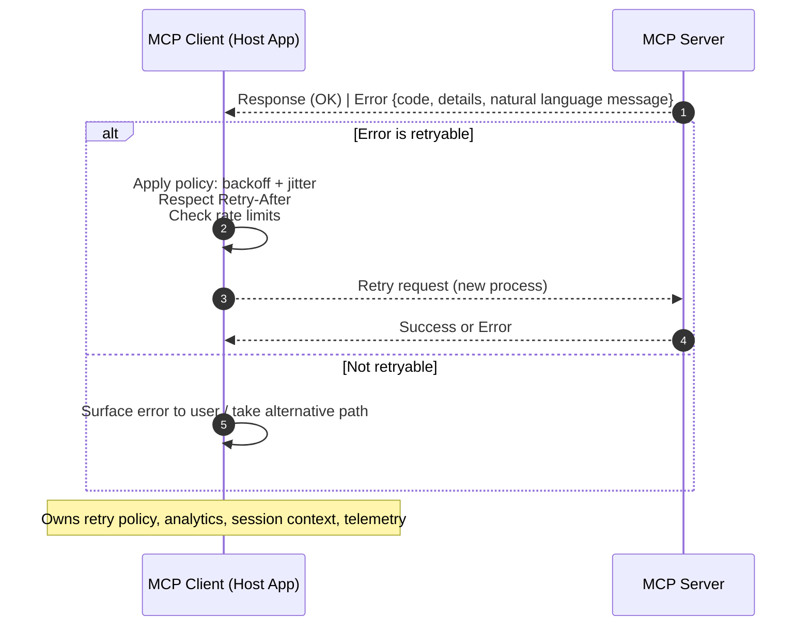

I asked a coding agent, IBM Bob, to add a retry mechanism to the watsonx.data Intelligence MCP server. In under an hour, it generated the system hierarchies, integrations, configs, tests, and documentation. It was beautiful. It was fast. And it shouldn’t exist. AI accelerates execution, and we need to vibe-check the result. 

***

## The Idea That Felt Right (But Wasn’t)

I set out to make a meaningful contribution to the watsonx.data Intelligence MCP development. This thought struck:

> "Let’s add fully automated retry logic to the MCP server."

It seemed right to add additional resilience and reliability to the server. I opened the Bob IDE and started prompting. I even tried to be thoughtful with my guidance:

> * "Prioritize reusing and extending existent codebase. Only introduce new modules when necessary."
> * "I like the idea, how would we implement and test it? how do you store the tracked information?"

Bob didn’t hesitate. It went full senior‑engineer mode.

***

## Bob’s Implementation Plan 

Bob drafted and executed a clean, four‑phase roadmap:

1.  Phase 1: Enhanced Exception Hierarchy
2.  Phase 2: Retry Decorator Framework
3.  Phase 3: HTTP Client Integration
4.  Phase 4: Configuration & Settings

```
    app/
    ├── core/
    │   └── retry.py                # NEW: Core retry framework (476 lines)
    ├── shared/
    │   ├── exceptions/
    │   │   ├── base.py             # ENHANCED: Add context
    │   │   └── retryable.py        # NEW: Retryable hierarchy (358 lines)
    │   └── utils/
    │       ├── http_client.py      # ENHANCED: Auto-retry integration
    │       └── retry_config.py     # NEW: Retry configuration system (330 lines)
    └── services/
        └── tool_utils.py           # REFACTOR: Example @with_retry usage
```

#### Phase 1: Enhanced Exception Hierarchy  
Files Created/Modified

*   `app/shared/exceptions/retryable.py` (NEW – 358 lines)
    *   Retryable: `TransientError`, `RateLimitError`, `ServiceUnavailableError`, `TimeoutError`, `NetworkError`
    *   Non‑retryable: `AuthenticationError`, `NotFoundError`, `InvalidInputError`, `ConflictError`, `QuotaExceededError`
    *   Smart HTTP status → exception mapping
    *   Rich metadata (`retry_after`, quotas, timeouts)
    *   Helpers: `get_exception_for_status_code()`, `is_retryable()`
*   `app/shared/exceptions/base.py` (ENHANCED)
    *   Added context support to `MCPServiceError`
    *   Improved error message formatting
*   `app/shared/exceptions/__init__.py` (UPDATED)
    *   Exports all new exception types

#### Phase 2: Retry Decorator Framework  
Files Created

*   `app/core/retry.py` (NEW – 476 lines)
    *   `@with_retry` (async) and `@with_retry_sync` (sync) decorators
    *   `retry_async()` utility
    *   `RetryConfig` (with validation) & `RetryContext` (tracks attempts)
*   `app/shared/utils/retry_config.py` (NEW – 330 lines)
    *   7 presets: `default`, `aggressive`, `conservative`, `rate_limit`, `network`, `quick`, `no_retry`
    *   `RetryConfigBuilder` (fluent configuration)
    *   Utility functions for preset management

#### Phase 3: HTTP Client Integration  
Files Modified

*   `app/shared/utils/http_client.py` (ENHANCED)
    *   Auto‑retry for GET/POST/PUT/PATCH
    *   Smart status‑code classification
    *   Retry‑After extraction and handling
    *   Network errors become retryable

#### Phase 4: Configuration & Settings  
Files Modified

*   `app/core/settings.py` (ENHANCED)
    *   7 retry configuration settings
    *   Global retry enable/disable
    *   Configurable retry parameters
*   `.env.example` (UPDATED)
    *   Documented all retry options with clear defaults


### Key Features Implemented

*   Smart Error Classification  
    Automatic HTTP status: exception type mapping, retryable vs. non‑retryable distinctions, rich error context

*   Flexible Retry Strategies  
    Exponential backoff (configurable base), jitter, respect for `Retry‑After`, per‑error rules

*   Easy Integration  
    `@with_retry()` decorators, presets for common scenarios, builder for custom configs, HTTP client auto‑retry

***

## But... The Feature Doesn’t Make Sense

All of these only took a random wednesday morning. After I came back from lunch, fed and caffeinated, some questions came up. 

> Why am I implementing retry mechanisms for the MCP server - what's the point of all of these? 
{:.prompt-warning}

In the MCP architecture:

*   Clients (host applications) - like Claude Desktop, GitHub Copilot, or even Bob - own the orchestration, retry, and exit logic.
*   MCP Servers can be used to execute tools, call APIs, and do the work. It returns structured error codes and a helpful natural‑language message in the case of failure so the clients can decide whether and how to retry.

Putting retries into the server is redundant. 


  

***

## The Real Lesson: How to Prevent This?

AI didn’t fail here. I did. By not validating the idea before building it, I boarded a bullet train on the wrong track. 

AI agents are phenomenal at producing plausible, pattern‑consistent, and sometimes even beautiful code. But they don’t challenge intent. They don’t ask "why are we doing this?" Not unless we ask them to. 

How do we address this problem? How should we vibe-check our vibe-coding practices? I am starting by changing the way I prompt, by adding literal vibe-checks 

### 1. Ask Implementation & Testability Questions Up Front

> "I like the first idea of enhancing the tool registry with metadata and analytics. But how will we implement and test it? Where do we store the tracked information?"

Why: Forces concrete thinking about data models, persistence, scope, and tests. If the answers are fuzzy, the idea either isn’t ready or needs additional scoping.

Bob’s typical helpful follow‑up:

> "Let me clarify how in‑memory storage works in the context of an MCP server (not per‑user session)."

### 2. A Literal Vibe-Check

> "Before I implement: does the current project already offer analytics? How does this tool help people using this MCP server? Is this capability owned by the MCP server or the MCP client (like GitHub Copilot)?"

Why: Reasserts separation of concerns and prevents server‑side creep.

Bob may respond:

> "You’re 100% correct. Server‑side analytics/health monitoring are meaningless in stdio mode."

> *   *Play devils advocate and identify why might this be wrong?*
> *   *How can this run in production? Does it align with the technology architecture*
> *   *"Analyze your previous answer for any factual errors, logical gaps, or missing information. What would you add or change to make it better?"*
{:.prompt-tip}

***

## Closing Thoughts

This experience didn’t make me less excited about agent assisted software development. It showed me that AI can build almost anything and it’s our job to decide what’s worth building. 

At the end of a day, it helped me fail fast, learn, and improve as an engineer. 

