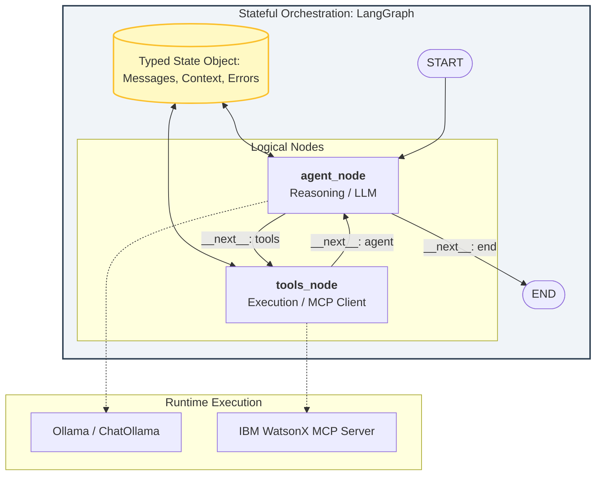
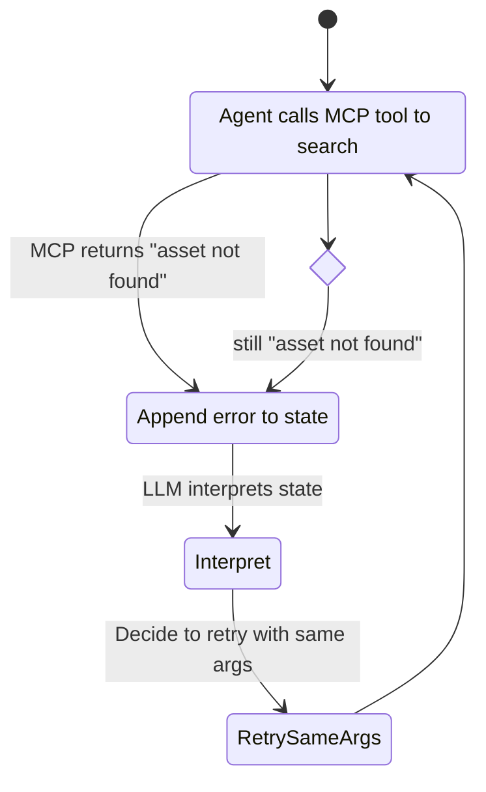
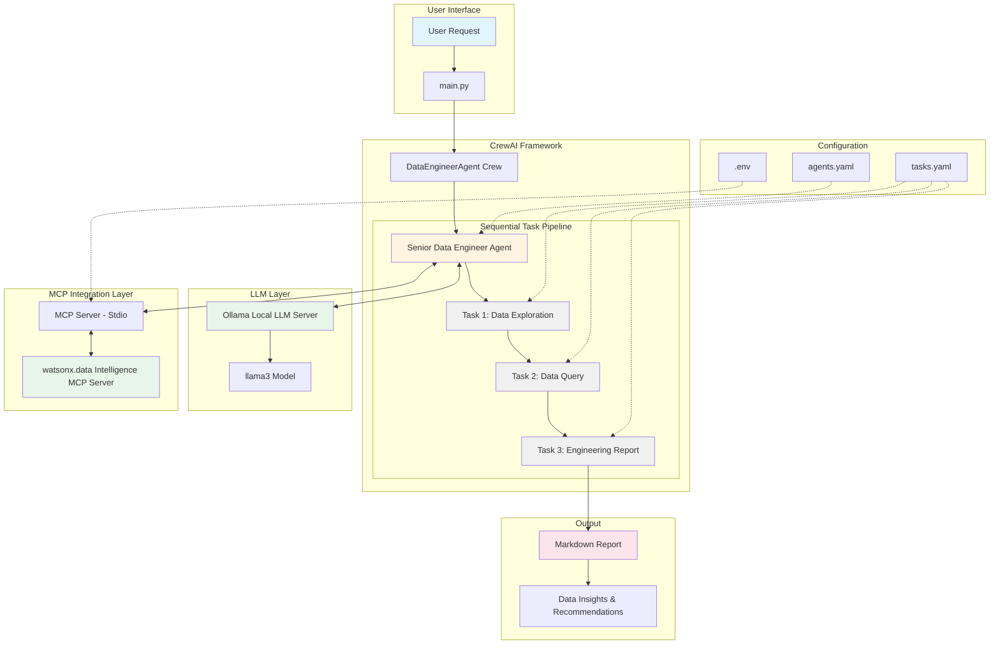
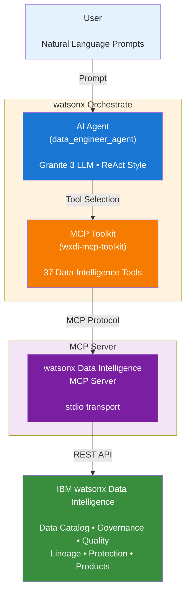

---

Last weekend I built a Data Engineer Agent with three different agentic frameworks: IBM watsonx.orchestrate, LangGraph, and CrewAI. My goal was to compare: 

> - How each framework thinks about agents
-  What developer experience feels like
-  Which frameworks is suited for enterprise vs. rapid prototyping vs. scalable production

Some of a data engineer's responsibility include managing data quality, maintaining data pipelines, publishing data product across the organization, analyzing data linage for impact and root cause analysis. I equipped all my agents with the [watsonx.data intelligence MCP server](https://github.com/IBM/data-intelligence-mcp-server), which connects to my governed catalog and is capable of: Text-to-SQL, Database exploration, Metadata enrichment, Lineage analysis, Governance checks, amongst others. 

This post combines:

1. A technical overview of each framework
2. Architecture
3. My personal experience
4. The engineering lessons learned

>Below are the github repos if you want to explore the implementations:
>- [Data Engineer Agent with IBM watsonx.orchestrate](https://github.com/Henry-Xiao-HX/data-engineer-agent-with-watsonx-orchestrate)
>- [Data Engineer Agent with LangGraph](https://github.com/Henry-Xiao-HX/data-engineer-agent-with-langgraph)
>- [Data Engineer Agent with CrewAI](https://github.com/Henry-Xiao-HX/data-engineer-agent-with-crewai)
{:.prompt-tip}

---

## LangGraph - Deterministic Stateful Agent Orchestration

### Technical Overview

> Graph-based, deterministic, production-oriented agent orchestration

LangGraph is part of the LangChain ecosystem and focuses on stateful, controllable agent workflows. Instead of “magic agent loops,” you build a graph of nodes where each node is a function, tool, or LLM call. It is designed for deterministic control, durable execution, time‑travel debugging, human‑in‑the‑loop, and multi-agent workflows. It conceptualizes agent interactions as stateful nodes and edges, allowing complex branching, loops, and long‑running tasks.

Its strength include: 
1. Explicit control flow: enforcing guardrails, validations, and custom routing
2. Built-in human-in-the-loop support
3. Persistence: State persistence makes it ideal for long-running pipelines
4. Time-travel: time travel allows developers to inspect, pause, modify, and resume agent execution from previous states (checkpoints) using persistent memory. 

And some of the challenges include: 
1. Steep conceptual overhead: careful design of the graph
2. Developer friendly: business users, not so much

---

### Architecture

---

### My Personal Experience

LangGraph gave me maximum developer control... and maximum responsibility.

I accidentally created an infinite loop while configuring the workflow, where

Fixing it required setting explicit retry limits, better error/exception handling, and implementing terminal failure states in the graph

### Lesson

LangGraph is incredibly powerful. It gives you 
* Production-grade orchestration
* Deterministic execution
* Complex multi-step workflows
* Data engineering pipelines
* Deep observability

But it also requires you to put on your engineering hat and carefully architect a good system. 

---

## CrewAI - Role-Based Multi-Agent Collaboration

### Technical Overview

> A multi-agent framework focused on collaborative reasoning using role-based abstractions.

CrewAI imagines workflows as teams of specialized agents collaborating on tasks. You define:

* Agents (roles, tools, personalities)
* Tasks
* Crews (coordinating agents)

Some of CrewAI's strength include: 
1. Multi-agent workflows out of the box
2. Natural language setup (Define roles like:"You are a senior data engineer specializing in scalable ETL pipelines.")
3. Fast prototyping 
4. Emphasis on task delegation

Its challenges are that most of the workflow comes from LLM reasoning, not deterministic, and that it's not as enterprise governed. 

---

### Architecture

---

### My Personal Experience

1. While easy to set up, I still have lots to learn to orchestrate the agentic workflow in CrewAI. Right now, all my agents were running sequentially every time, which is not truly agentic. An intelligent agentic workflow should include: Conditional delegation, hierarchical control, agents deciding when to act, etc. Right now, my workflow is more procedural than agentic.

2. CrewAI does not provide an out-of-the-box chatbot experience, which many of us has gotten used to with other frameworks. 

---

## watsonx.orchestrate - Enterprise Agent Orchestration Platform

### Technical Overview

> An enterprise-grade AI orchestration platform that combines workflow automation, policy control, and LLM reasoning.

IBM watsonx Orchestrate is an enterprise‑grade orchestration layer designed to unify AI agents across business workflows. It provides prebuilt domain agents, no‑code & low‑code agent building, centralized governance, and deep integration into enterprise systems. It coordinates cross‑system workflows with strong compliance features.

Some of its strength include: 

* AI-powered workflow automation
* Skill-based orchestration
* Native enterprise governance
* Integration layer for business systems
* Catalog of prebuit agents

As it lowers the technical curve for business users, some developers may find it limited in customizability.  

---

### Architecture

---

### My Personal Experience

This was the easiest to stand up. Enterprise connectors and governance alignment were natural. Compared to the other two: there's less low-level coding, less custom state modeling, faster integration with enterprise data assets, and easiest to deploy. However, it is not entirely developer-focused, and I have less experimental flexibility. But in enterprise environments, that is often an advantage.

---

### Where watsonx.orchestrate Excels

* Enterprise AI deployment
* Governance-heavy environments
* Regulated industries

---

## Side-by-Side Technical Comparison

| Dimension            | LangGraph                 | CrewAI                 | watsonx.orchestrate       |
| -------------------- | ------------------------- | ---------------------- | ------------------------- |
| Strength: | Reliability, highly customizable, long‑running tasks| Fast development, intuitive modeling of human workflows | Enterprise workflows, compliance, cross‑system automation | 
| Core Model           | Graph-based state machine | Role-based multi-agent | Skill-based orchestration |
| Control Level        | Very High                 | Medium                 | Medium-Low                |
| Determinism          | Strong                    | Emergent               | Structured                |
| Governance Alignment | Manual                    | Manual                 | Native                    |
| Debuggability        | High                      | Moderate               | Moderate                  |
| Enterprise Fit       | Moderate                  | Moderate               | Very High                 |

---

## Final Reflection
To conclude, the choice between these frameworks depends on the required balance of determinism, abstraction, and governance. I recommend LangGraph for workflows requiring granular state management and strict cyclical control. Its directed acyclic graph (DAG) and "human-in-the-loop" capabilities make it the superior choice for complex, high-stakes data pipelines where logic must be explicitly constrained. Conversely, CrewAI is my preferred choice for rapid prototyping and role-based multi-agent orchestration. By abstracting the communication overhead between specialized agents, it allows you to quickly model a collaborative human organization to solve multifaceted data problems with minimal boilerplate.

For production-grade deployments, watsonx.orchestrate provides the necessary infrastructure to scale these agentic workflows across the enterprise. While LangGraph and CrewAI excel in the development environment, watsonx.orchestrate offers the low-code environment, API integration, security guardrails, and managed execution environment required to operationalize AI agents enterprise-wide. 

Ultimately, as agentic AI become even more capable, our values are in long-term architectural foresight and nuanced stakeholder needs. Moving forward, I’m focusing less on being a "coder" and more on being a "systems designer" who can audit and guide these agentic workflows.