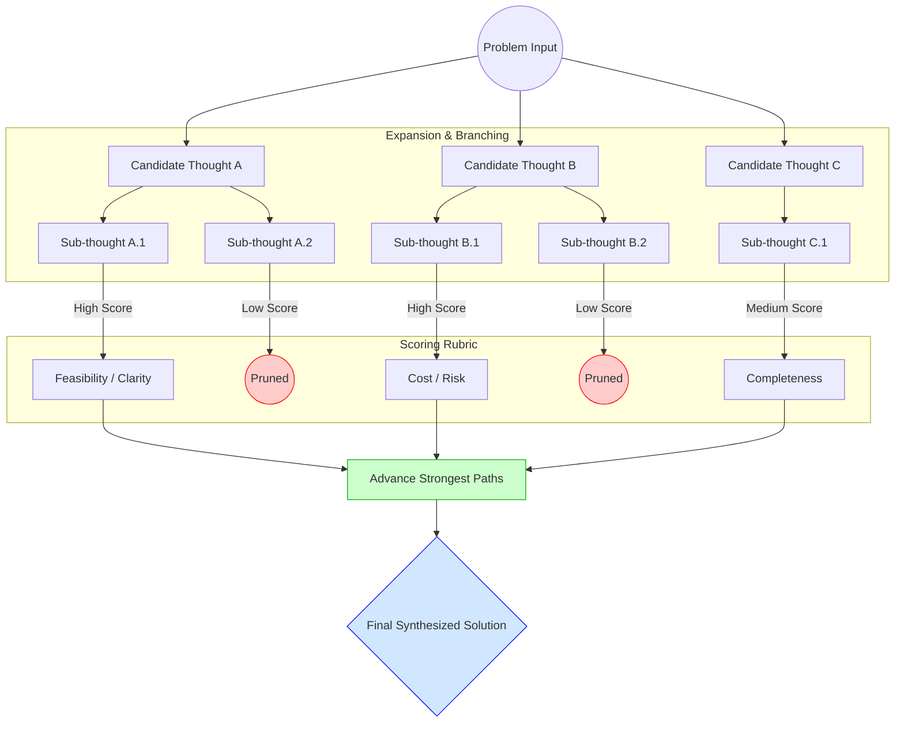
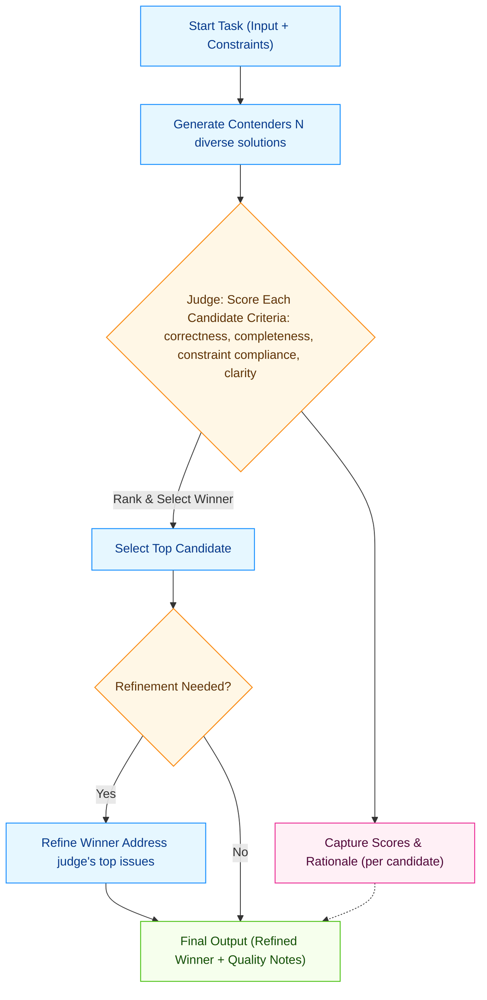

As large language models (LLMs) move into production, effective prompting looks and feels like system design: constraints, modularity, self-checks, and rigorous evaluation. This guide introduces eight techniques/patterns you can leverage for effective prompt engineering.

1.  Constraint‑Driven Prompts
2.  Prompt Chaining
3.  Self‑Correction Loops
4.  Evaluation & Red‑Teaming
5.  The Interview Pattern
6.  Chain of Thought (CoT) Pattern
7.  Tree of Thought (ToT) Pattern 
8.  The Playoff Pattern

***

## 1. Constraint‑Driven Prompts

### What it is

A method of specifying strict rules, formats, and boundaries so the model’s response space is tightly controlled.

### How it works

*   Define structured outputs (JSON/XML/tables).
*   Add explicit rules (e.g., “Choose exactly one category”).
*   Provide schemas to constrain fields and types.
*   Set linguistic limits (tone, length, vocabulary).

### Why it works

Constraints reduce ambiguity and creative drift, improving format reliability, reproducibility, and compatibility with downstream parsers-acting like an API contract for your prompt.

### Example

```text
Task: Classify the following text into exactly one category.

Allowed categories: ["Security", "Finance", "Operations", "HR"]

Output format (JSON):
{
  "category": "<one-category-only>"
}

Rules:
- Choose exactly one category.
- Do not explain your reasoning.
- If unsure, choose the closest match.
```

***

## 2. Prompt Chaining

### What it is

Decompose a complex task into a sequence of simpler, deterministic prompts-each responsible for one stage.

### How it works

Typical pipeline:

1.  Interpret the request
2.  Extract relevant information
3.  Plan the output or reasoning
4.  Generate the final answer

Each step feeds the next, similar to microservices.

### Why it works

Narrow tasks reduce cognitive load, lower compounding errors, simplify debugging, and create reusable building blocks for different workflows.

### Example

Step 1 - Extract key facts

```text
Extract all key facts from the text in bullet form. No interpretation.
```

Step 2 - Create a structured outline

```text
Using the extracted facts, create a hierarchical outline.
```

Step 3 - Generate final content

```text
Write a concise summary based on the outline. Avoid adding new information.
```

***

## 3. Self‑Correction Loops

### What it is

A multi‑pass pattern where the model drafts, critiques the draft, then rewrites an improved version.

### How it works

1.  Draft - initial solution
2.  Critique - detect errors, gaps, violations
3.  Refine - produce a corrected version  (Repeat if necessary)

### Why it works

Evaluation is often easier than generation. Separating the two reduces logical mistakes, increases completeness, and improves format compliance.

### Example

Step 1 - Draft

```text
Produce the best answer to the user’s question.
```

Step 2 - Critique

```text
List any errors, missing details, logical gaps, or unclear steps in the draft above.
Do not rewrite the answer yet.
```

Step 3 - Refine

```text
Rewrite the answer to fix all issues listed in your critique.
```

***

## 4. Evaluation & Red‑Teaming Your Prompts

### What it is

A systematic process to test prompts with adversarial, ambiguous, malformed, or extreme inputs to uncover weaknesses.

### How it works

*   Create test suites that include edge cases, noise, ambiguous questions, contradictions, domain shifts, and constraint stress tests.
*   Measure failures, refine constraints/steps, and re‑test until stable.

### Why it works

LLMs often fail on edges, not the median. Red‑teaming reveals brittleness, hallucination triggers, format violations, and overgeneralization, improving production reliability.

### Example

```text
1. Define success criteria:
   - format correctness
   - task accuracy
   - reasoning completeness

2. Build 20–50 diverse tests (normal + adversarial). 

3. Run the prompt across the suite and log failures.

4. Identify repeated failure patterns.

5. Strengthen constraints or add intermediate steps to the chain.

6. Re-test until failure rates meet your threshold.
```

***

## 5. The Interview Pattern

### What it is

A clarifying‑question pattern: the model asks targeted questions before answering to turn a vague or under-specified query into a well‑defined one like how a consultant, designer, or engineer would gather requirements before starting work.

### How it works

*   Detect whether the user’s request is under specified.
* Adopt a relevant expert persona (e.g., SEO specialist, product designer, editor).

### Why it works

Pre‑alignment reduces misinterpretation, surfaces hidden constraints, and lowers rework-especially for open‑ended tasks and content generation.

### Example

```text
You will act as a senior SEO and content marketing expert.

Your task is to interview me to gather ALL necessary information before creating content.
Ask me questions ONE at a time.

Rules:
1. Do NOT generate any content until all relevant questions have been asked.
2. Ask as many questions as necessary to produce an excellent result.
3. Tailor your questions to SEO, content strategy, search intent, audience profile,
   competitive positioning, and content goals.
4. After all interviews are complete, restate the full requirements.
5. Then produce the final deliverable optimized for SEO and content performance.

Your first message should be:
"Before I create your content, I need to interview you. Let's start with the first question:
Who is your target audience for this piece?"
```

***

## 6. Chain of Thought (CoT) Pattern

### What it is

A reasoning approach that solves problems via intermediate steps rather than jumping straight to the answer. In production, the reasoning is typically kept internal; only the final result is shown.

### How it works

*   Instruct the model to reason step‑by‑step internally.
*   Encourage checks against constraints and units internally.
*   Return only the final answer (optionally with a brief justification).

### Why it works

Breaking problems into subgoals reduces logical leaps and improves systematic coverage of edge cases and constraints-boosting correctness without exposing long reasoning traces.

### Example

```text
You will solve the problem using internal step-by-step reasoning.
Then provide only the final result in the required format.

Instructions:
- Think through subproblems, constraints, and edge cases internally.
- Double-check calculations and units internally.

User-visible output format:
Final Answer: <concise result only>
```

***

## 7. Tree of Thought (ToT)

### What it is

Tree of Thought (ToT) is a structured reasoning technique where the model explores multiple possible solution paths in parallel rather than committing to a single line of thought. Instead of moving linearly from question to answer, the model generates several branches (hypotheses, strategies, interpretations), evaluates them at each stage, and selects the most promising path forward.

This mirrors how human experts solve complex problems-by considering multiple angles, testing parallel hypotheses, discarding weak options, and converging on the strongest solution.

***

### How it works

A typical ToT workflow involves:

1.  Generate multiple candidate thoughts  
    e.g., three different ways the problem could be interpreted or solved.

2.  Expand each candidate  
    Each thought leads to sub‑thoughts, forming a branching structure.

3.  Evaluate branches  
    The model uses a scoring rubric (e.g., feasibility, cost, risk, clarity, completeness) to assess which branches are strong.

4.  Prune weaker branches  
    Low-value paths are discarded early to keep the search efficient.

5.  Advance the strongest branches  
    The model continues reasoning down the best paths and synthesizes a final solution based on the most promising branch or a combination of them.

This effectively transforms the LLM into a mini search engine navigating a decision tree.


***

### Why it works

Tree of Thought excels because it introduces deliberate reasoning structure, which improves quality in problems involving:

*   uncertainty (multiple plausible interpretations)
*   competing priorities (cost vs. quality vs. time)
*   multifaceted trade-offs (nutrition, budget, convenience)
*   strategic planning (scheduling, optimization, decision-making)

By exploring several paths, the model avoids tunnel vision and increases the likelihood of finding a robust, well-rounded solution.

This multi-angle approach is especially powerful because it mimics expert reasoning strategies used in fields like medicine, engineering, and financial planning.

***

### Example

Prompt:  
You are helping a family of four plan healthy meals for the week on a tight budget.  
Follow this structure:

Step 1 - Propose three different meal-planning strategies (label them A, B, C). For example:

*   A: Vegetarian-heavy meals
*   B: Mix of bulk grains and frozen foods
*   C: One-pot meals to reduce prep

Step 2 - For each strategy, list:  
a. Estimated cost per day  
b. Nutritional strengths  
c. Convenience level (prep time, cleanup)

Step 3 - Compare the three strategies and choose the best one.  
Explain why it is the most practical based on cost, nutrition, and convenience.

***

## 8. The Playoff Approach

### What it is

An ensemble‑style self‑competition: generate multiple independent answers, have a judge compare them with a rubric, pick the winner, and optionally refine it.

### How it works

*   Contenders: Produce N diverse solutions under shared constraints.
*   Judge: Score each against a rubric; select the winner and key issues.
*   Refine (optional): Improve the winner based on the judge’s notes.
*   Can use a single model (self‑play) or multiple models (heterogeneous ensemble).



### Why it works

Diversity + selection counters single‑shot blind spots. The judge enforces explicit criteria (correctness, completeness, compliance), and refinement removes residual errors-often boosting quality via orchestration, not rewriting.

### Example

```text
Task: Produce the best solution via a playoff (self-competition).
All internal analysis stays hidden. Return only the final output JSON.

Round 1 - Contenders (internal):
- Generate 3 diverse solutions complying with the same constraints.

Round 2 - Judge (internal):
- Score each 0–5 on: correctness, completeness, constraint compliance, clarity.
- Select the winner; note the top 2 issues to improve.

Round 3 - Refine (internal):
- Rewrite the winning solution addressing those issues.

Final Output (JSON only):
{
  "final_solution": "<refined winner>",
  "quality_notes": ["<short note 1>", "<short note 2>"]
}
```

***

## How These Techniques Fit Together

*   Start with Constraint‑Driven Prompts to define the contract.
*   Use Prompt Chaining to modularize complex tasks.
*   Layer CoT / ToT internally for difficult reasoning steps.
*   Add Self‑Correction Loops to automatically improve drafts.
*   Employ Playoff for ensemble diversity on hard tasks.
*   Continuously Evaluate & Red‑Team to harden against edge cases.

This stack yields predictable, production‑ready behavior across varied scenarios.
