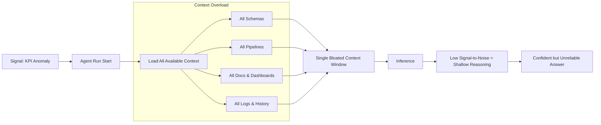
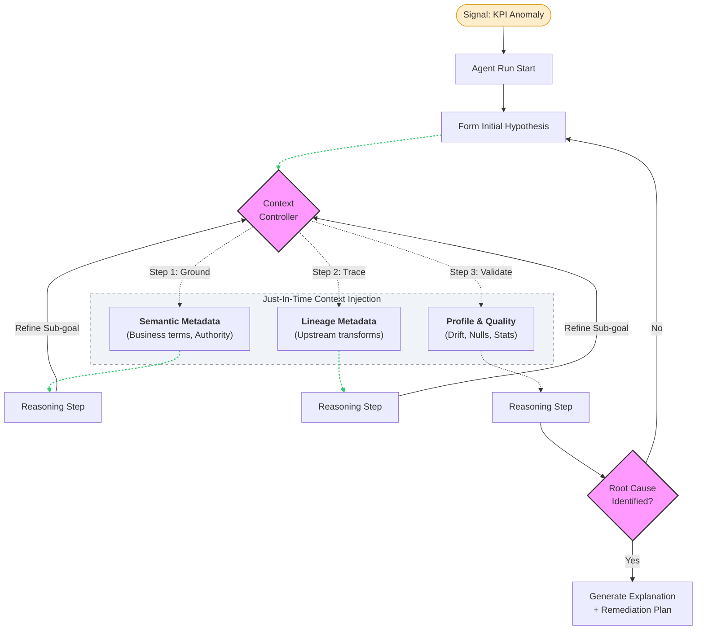

Take a look at the following two architectural diagrams of a data engineering agent responding to the same revenue KPI anomaly. Both have access to the same underlying data. Yet one may quickly converge on a plausible explanation, while the other may drown in context, bloated prompts, and irrelevant information. What's the difference? 

This blog explores how context engineering, combined with governed metadata, enables enterprise agents to reason effectively without suffering from context pollution or information overload. We’ll examine the shift from “dump everything into the prompt” architecture, and how metadata‑driven designs allow agents to remain effective in real enterprise environments.

***
Diagram 1

***
Diagram 2

## 1. Context engineering: what is it?

As AI systems evolve from single‑shot prompts to long‑running, multi‑step agents, prompt engineering alone is no longer sufficient. This shift is articulated in Anthropic’s engineering blog *“Effective Context Engineering for AI Agents”*. [\[anthropic.com\]](https://www.anthropic.com/engineering/effective-context-engineering-for-ai-agents)

Anthropic defines context as the full set of tokens available to a large language model at inference time - including system instructions, tool definitions, conversation history, and external data. Context engineering, then, means strategically curating and maintaining the optimal set of those tokens to reliably drive desired model behavior under the constraints of a finite context window.

The key motivation for context engineering arises from several structural realities of LLMs:

* Agent state grows over time: agents operating over multiple turns continuously generate intermediate outputs, tool results, and decisions that could be relevant later - but cannot all be retained indefinitely. [\[anthropic.com\]](https://www.anthropic.com/engineering/effective-context-engineering-for-ai-agents)
* Context is finite: LLMs have a limited attention budget. As more tokens are added, the utility of each additional token diminishes.
>This attention scarcity stems from architectural constraints of LLMs. LLMs are based on the transformer architecture, which enables every token to attend to every other token across the entire context. This results in n² pairwise relationships for n tokens. As its context length increases, a model's ability to capture these pairwise relationships gets stretched thin. [\[anthropic.com\]](https://www.anthropic.com/engineering/effective-context-engineering-for-ai-agents)

It is therefore important to have good context engineering to maximize the systems' performance, some techniques mentioned in the blog include effective usage of system prompts, tools, and other techniques for long-horizon tasks including compaction, structured note-taking, and sub-agent architectures. In the rest of the blog we will expand on context retrieval and agentic search. 

***

## 2. "Just in Time" context strategy

Rather than pre-processing all relevant data up front, agents built with the “just in time” approach maintain lightweight identifiers (file paths, stored queries, web links, etc.) and use these references to dynamically load data into context at runtime using tools.[\[anthropic.com\]](https://www.anthropic.com/engineering/effective-context-engineering-for-ai-agents)

A just in time approach mimics how we as human operates. Most of the time we don't brutely memorize the information, but have bookmarks, organization systems, file systems, and other sources to look for the information. We use naming conventions, timestamps, folder hierarchies to help us make sense of the information. 

Correspondingly, an agent need to have the data that describes the data to

* decide *which* information is relevant for the current reasoning step.
    * which sources are authoritative?
    * which definitions apply in the current business domain?
    * which data is permissible for this task and user?
    * which information is fresh, certified, or deprecated?
* decide *how* to utilize the information
* decide *when* to utilize the information

Data describing data - sounds a lot like metadata! 

***

## 3. What metadata exists in an enterprise

While implementations vary, enterprise metadata commonly spans the following categories.

#### Technical Metadata

Describes the physical and structural properties of data assets:

*   Schemas, tables, columns, data types
*   File formats and storage locations
*   Indexes and partitions

This metadata answers *what exists* and *where it lives*.

#### Governance, Lineage, and Policy Metadata 

*   Upstream and downstream dependencies
*   Transformation logic
*   Sensitivity classifications (e.g., PII, sensitive information)
*   Access Control
*   Retention and usage policies

This metadata answers *where the data came from*, *can this user access it*, and *how trustworthy it is*

#### Business Metadata

Captures shared meaning and intent:

*   Business glossaries and term definitions
*   Classification and tagging
*   Metric logic and calculation rules
*   Domain ownership and stewardship
*   Mapped relationships 

This metadata answers *what the data means*.

#### Social Metadata

* LOB knowledge 
* User generated contents including ratings, comments, popularity scores 

This metadata answers *what the data means to humans*.

With metadata, an agentic system can retrieve the appropriate context and perform its tasks. Let's look at the example from the beginning of the blog - how is metadata utilized by an agent? 

## 4. An data engineer agent example
Coming back to the start of the blog. 

Consider a data engineer agent tasked with analyzing a revenue KPI anomaly. We employed just-in-time context strategy to avoid bloating the prompt window. It reasons over governed metadata as opposed to dumping the raw text into context window: 

* Discovery: It first injects high-signal catalog and enrichment metadata to identify the authoritative dataset and its semantic meaning.

* Traceability: It then pulls a minimal lineage slice to reason specifically about upstream transformations.

* Validation: The cycle concludes by layering in granular data-quality signals (e.g., drift, null rates, and profile distributions) to validate the causal link.

## 5. How do we manage and govern this metadata layer? 

We know why metadata is important for context engineering now, but metadata are often scattered in an enterprise, across APIs, databases, messaging platforms, dashboards, pipelines, models, storage. An governing platform is needed to manage this metadata layer. Some popular platforms include IBM watsonx.data intelligence, Informatica, Atlan, etc, with IBM recognized as a Leader in Gartner 2025 Magic Quadrant for Metadata Management Solutions. In the next blog, let's discuss more on these enterprise platforms. 

## 6. Conclusion
Effective agentic system have evolved to require context engineering. In the just-in-time context retrieval approach, the agent reasons over governed metadata first to determine what is relevant and inject the information in inference time without bloating the context window. Overall, this metadata layer, alongside good context engineering prevents context pollution and allows the agent to reason clearly over long horizons.

***
