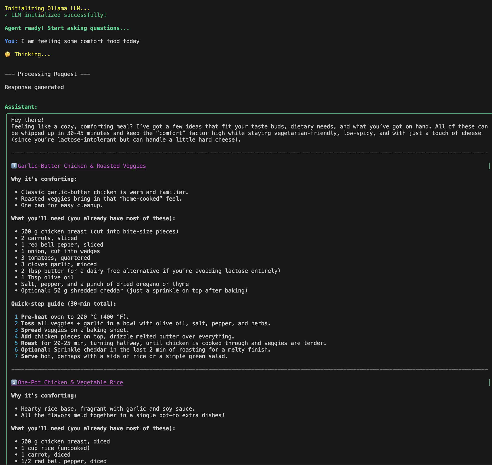
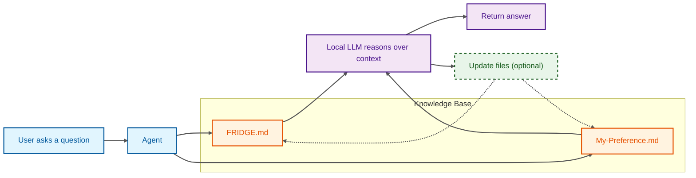

I spend most of my professional time working on Data & AI systems with layered complexities: distributed data and applications, production constraints, observability, safety, and scale.

This personal project intentionally explores the opposite direction: simplicity. The inspiration? A very ordinary problem that happens to all of us: deciding what to cook for dinner with whatever is in the fridge. And if you know me, you know I am a big FOODIE. 

So over this weekend, I built an AI agent that reads what’s in my fridge, remembers my food preferences, suggests recipes for dinner, and learns from our conversations histories. Before starting, I imposed a constraint on myself to keep the system simple and local. The result is a small agent that runs entirely on my laptop, stores state in markdown files, and uses Ollama for local model inference. It may not be reliable or scalable, but it certainly is fun!

> Me: I am feeling some comfort food today...
{:.prompt-tip}



This post walks through the design, the decisions, and what I *didn’t* build.

***


## Some architectural design
At its core, everything is just files and a controlled agent loop:

Two markdown files hold all the state: 
*   `FRIDGE.md` captures what I actually have in the fridge and pantry. 
*   `My-Preference.md` captures my food preferences

For every response, the agent
*   reads both files
*   generates a response using the context
*   updates those files if/when new information appears in conversation

That's it. there are no distributed databases, cloud APIs, multi-agent architecture. Just an agent loop manipulating markdown files. As an enterprise AI engineer, I spent most of my time with complex architectures. Now I just wanted something that is simple and playful. 




### LangChain
I did use LangChain in this project to provide some scaffolding: 

*   A model abstraction layer, so I can swap Ollama models easily
*   Filesystem tools for reading and writing markdown files

I didn't use its agent frameworks, planner/executor abstractions, memory modules, and other more advanced features. Those can be saved for other more complex projects. 

***

### The agent loop

The core logic lives in a small custom class (`SimpleCookingAgent`):

*   Loads fridge contents and preferences into every prompt
*   Tracks conversation history for the session
*   Uses tools to read/write markdown
*   Reflects once at the end of a session to update preferences

### Ollama local inference

Inference runs entirely through Ollama, using a local model (`llama3.2` by default), with minimal configuration.

```yaml
ollama:
  model: "llama3.2"
  temperature: 0.7

agent:
  max_iterations: 15
  verbose: true
```

*   Temperature 0.7 gives creative but coherent recipes
*   Iteration limits keep the agent bounded
*   Verbose mode exposes reasoning and tool usage

Responses typically take 2–5 seconds, which is more than acceptable for this use case helping me decide dinner. 

### Markdown files

State lives in two markdown files because they are simple, human-readable, and easy to edit manually in a text editor. I am relying on LLM's capability to understand natural language as opposed to a relational schema or even structured JSON. This may seem unusual compared to structured storage, but it works well for a small personal project.


### Session-based learning 

When you exit the agent, it performs a simple reflection step:

1.  Reads the full conversation
2.  Asks the LLM whether new preferences were mentioned
3.  Compares against existing preferences
4.  Updates `My-Preference.md` only if something changed
5.  Timestamps the update

This allows casual statements like:

> “I’m really into spicy food lately”

to become persistent knowledge - without me having to tell the agent every time what I like to eat.

This pattern - session-scoped reflection rather than continuous memory updates - is something I’ve found useful in larger systems as well.


***

## What would change in production

Of course, all of these falls apart in a real production system: then we need to think about support for multiple users, prompt injections, scalability, and reliability. 

#### State & concurrency

Markdown files don’t scale.
Production systems need structured storage, concurrency control, and versioning.

#### Security & tool access

Local trust doesn’t translate to shared systems.
Right now, I am the only user. 
In production:
- Tool access must be scoped
- Write operations must be validated
- Prompt injection becomes a real threat

#### Context management

As conversation history grows, you need summarization strategies, context window management, explicit memory boundaries. 

#### Observability

Verbose logs are great locally. Production requires structured logs, tracing across agent steps, clear visibility into tool usage for audibility. 

#### Model operations

Local models are fine for personal use. At scale, you need versioning, rollout strategies, and fallbacks.


***

## Closing thoughts

This project intentionally avoids most of the complexity that usually surrounds AI systems. It’s a small, local agent with simple tools, markdown-based state, and a straightforward agent loop.

And as a side effect, I now waste less food and make better dinners - which is a satisfying outcome for a weekend AI experiment. 

