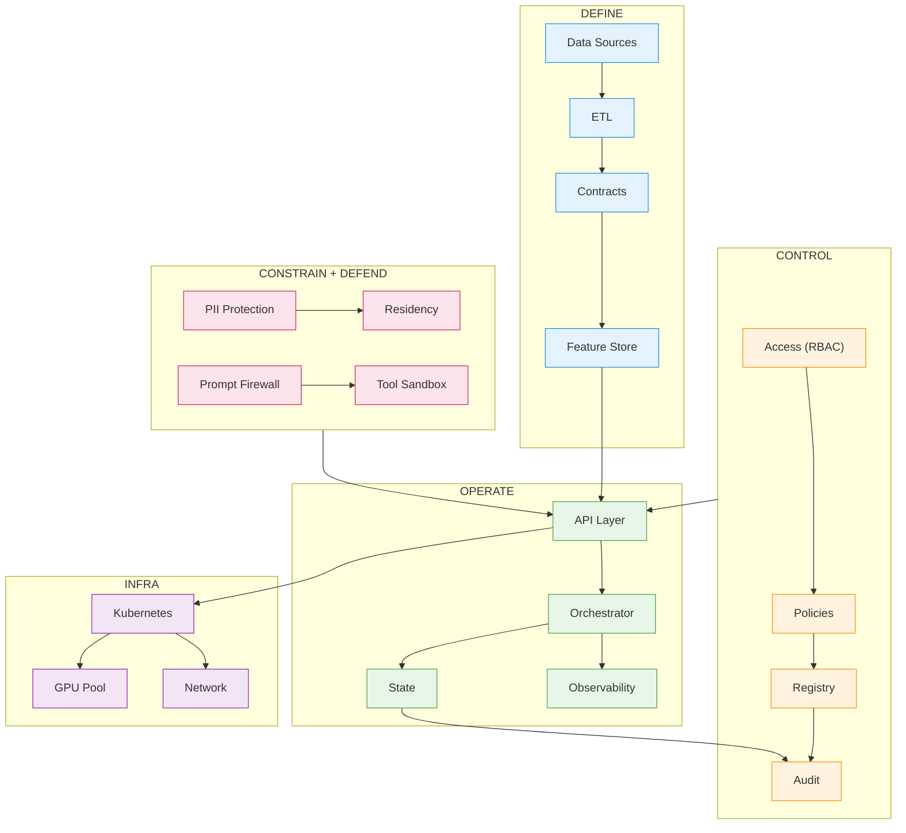

In our upcoming series **Two Many Chefs in the Kitchen**, we will explore some of the challenges putting AI to production. We don't have a simple solution to address all of these problems, and we are not sure one such solution exits right now. But now you know these problem exists and what to watch out for as you build. 

The advance of Agentic programming has lowered the learning curve for building AI products. It takes a very short time to build a semi-impressive prototype. But moving from prototype to production is where things start to break. Data is inconsistent. Outputs are unpredictable. Costs grow faster than expected. And risks like security, privacy, and regulatory compliance become impossible to ignore. Putting AI into production requires defining data contracts, enforcing governance, securing new attack surfaces, managing probabilistic behavior, and operating systems that evolve over time. 

This series categorizes the challenges in five production pillars: **Define** (Data Foundation), **Control** (Governance and Ownership), **Constrain** (Compliance and Regulation), **Defend** (Security), **Operate** (Reliability, Infrastructure, Costs). We will draw on our experience in the Financial Service Industry. For contrast, we will also include my fun personal agent and the inspiration for this series, my [Personal Chef Agent](https://henry-xiao-hx.com/posts/How-I-Built-A-Local-AI-Agent-That-Helps-Me-Decide-What-I-Cook-For-Dinner/). In the following episodes, we will dive into these sections for more details. 

| Pillar     | Demos                 | Production                                      |
|------------|------------------------------------|-----------------------------------------------------------------------|
| Define     | Hard-coded CSV or mock data.       | Real-time ETL, data contracts, and feature stores.                    |
| Control    | "I'm the admin, I ran the script." | RBAC, audit logs, and model versioning (MLflow/W&B).                  |
| Constrain  | Ignoring PII for speed.            | PII masking, SOC2 compliance, and residency locks.                    |
| Defend     | Assuming the user is "good."       | Prompt injection firewalls and "Red Teaming" cycles.                  |
| Operate    | Running on a local laptop/notebook.| Kubernetes, GPU auto-scaling, and latency budgets.                    |

---

## Define: Data Foundations
AI systems depend on data just like any traditional software system. Most organizations don’t have reliable access to clean, well-defined data. Data lives in silos, lacks consistent definitions, and may not provide real-time access. 

### Compare and Contrast: Personal Project vs Enterprise System
*   **The Salty Saboteur:** A simple recipe agent is a playground for a mischievous roommate. If your threshold of "spice tolerance" is changed, your agent may end up suggesting way more Szechuan Pepper than needed for a weeknight recipe. 
*   **The Enterprise Mandate:** In the demo phase, you might rely on hard-coded CSVs or mock data to prove a concept. But in production, you need real-time pipelines, strict data contracts, and feature stores. Imagine a Wealth Management AI providing investment advice: if your data definitions for "risk tolerance" change in the backend but the model isn't re-evaluated via a formal data contract, the AI might start recommending aggressive stocks to retirees.

---

## Control: Governance and Ownership Across AI Systems
When an AI system produces an output or takes an action, who is responsible? Governance in AI includes policy and enforceable control. Without clear ownership, technical issues quickly become organizational failures.

### Compare and Contrast: Personal Project vs Enterprise System
*   **The Salty Saboteur:** Who’s actually in charge of the menu? If your roommate installs a "Budget Spice" plugin that secretly prioritizes high-margin salt brands, who's responsible? Without clear ownership of the system prompts, your kitchen has a new, uninvited head chef.
*   **The Enterprise Mandate:** In a prototype, governance is often just a dev saying "I ran the script." Production requires proper access control, audit logs, and model versioning. Consider an Automated Loan Approval system: if the model begins denying loans to a specific demographic, who's responsible for the consequences? You must be able to use audit logs to prove which specific version of the prompt or training dataset caused the bias. 

---

## Constrain: Privacy, Compliance, and Regulations
AI systems frequently interact with sensitive and regulated data. This section focuses on systems that respect privacy and meet regulatory requirements from the start.

### Compare and Contrast: Personal Project vs Enterprise System
*   **The Salty Saboteur:** Your agent knows too much. If you're planning a secret surprise party, a prototype agent might accidentally blurts out the guest list to the very person you're trying to surprise because it lacks "information barriers."
*   **The Enterprise Mandate:** A prototype might ignore sensitive data just to move faster - but production systems require PII masking, compliance frameworks like SOC 2, and data residency controls. If a customer support LLM has access to raw chat logs with credit card numbers, that data can be leaked into the model's weights. A single leak costs money and deals reputational damage.

---

## Defend: Security and Adversarial Behavior
AI introduces a fundamentally new security model. Systems no longer just execute code - they interpret instructions, sometimes from bad intentions.

### Compare and Contrast: Personal Project vs Enterprise System
*   **The Salty Saboteur:** If your roommate is feeling particularly dark, they might bypass your "safe cooking" filters. Suddenly, your recipe agent maybe giving you the "experimental chemistry" instructions.
*   **The Enterprise Mandate:** In a demo, you assume users will behave well. In production, you must actively defend against prompt injection and run rigorous red-teaming exercises. An attacker might hide a command in the "white space" of an invoice PDF. If you haven't defended the reasoning layer, your AI becomes a highly efficient, automated embezzler.

---

## **Operate: Reliability, Infrastructure, Cost**
A system that works in a demo is not a system you can operate. Production AI systems must run at scale, under latency constraints, and with predictable costs.

### Compare and Contrast: Personal Project vs Enterprise System
*   **The Salty Saboteur:** Your recipe agent works great on your laptop while you're home alone. But if you host a dinner party for twenty people and everyone tries to customize their meal at once, the local script crashes, and everyone ends up eating cold cereal.
*   **The Enterprise Mandate:** The gap here is massive: a demo might run on a laptop or a notebook, but production systems rely on distributed infrastructure, auto-scaling, and strict latency/cost constraints. This is where reliability is tested. If your infrastructure can’t efficiently manage the long-term context or scale to handle thousands of concurrent users, your system remains a stateless toy rather than a reliable tool.

---

## Conclusion 
**Again, we don't have a solution to address all of these problems. We are simply giving you some FOOD for thoughts.**