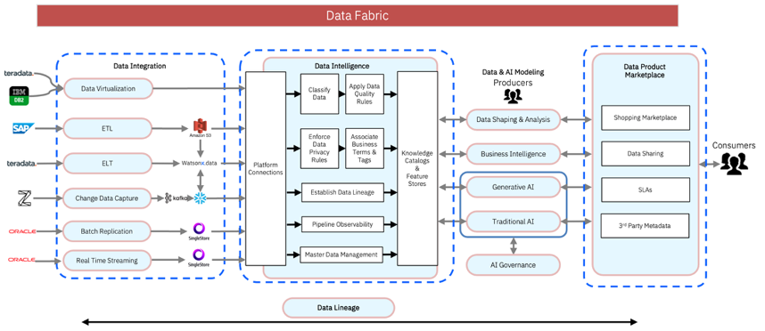

Data engineering has deep roots. While our stack evolves from on-premise clusters to hybrid clouds, the mission remains constant: ensuring data integrity, availability, and movement. For the veteran architect who has mastered the data fabric-from designing complex ETL/ELT patterns to real-time streaming-a cynical question often arises: If our core challenges haven't changed since the pre-LLM era, why should we care about AI?

The answer lies not in replacing the logic of data movement, but in scaling the operational intelligence required to manage it.

## The Agentic Shift
We are entering the era of Agentic Data Engineering, where AI agents function as autonomous extensions of the engineering team. Unlike standard chatbots that merely suggest code, these agents are functional entities capable of:

* Autonomous Discovery: Scanning fragmented metadata to identify latent joins and redundant assets.

* Performance Optimization: Refactoring compute-heavy SQL based on query plan analysis.

* Dynamic Lineage Analysis: Tracing schema drift upstream in real-time to prevent downstream outages.

What enabled this shift? How is Agentic Data Engineering possible? 

## The Architecture of an Agentic Ecosystem

To move from "Chat" to "Agent," three components must converge: Reasoning, Interoperability, and Codification.

### 1. The Brain: Reasoning over Pattern Matching
The difference-maker in modern tools (such as IBM Bob) is the shift from stochastic text generation to Chain-of-Thought reasoning. A true data agent doesn't just match a regex pattern; it understands context. It can orchestrate multi-step workflows, execute changes across a repository, and self-correct by evaluating execution logs against the original architectural goal.

### 2. The Nervous System: Model Context Protocol (MCP)
If the LLM is the brain, the Model Context Protocol (MCP) is the nervous system. MCP is a standardized, open-source orchestration layer that creates a universal interface between LLMs and the data stack.

While traditional LLMs are isolated, MCP enables agents to interact directly with live environments—Snowflake, Postgres, or dbt. It transforms the AI into a runtime-integrated operator. Once you deploy an MCP server for your data catalog or warehouse, any AI agent can "inspect" the environment to make informed, data-driven decisions rather than hallucinating based on training data.

### 3. The Action Space: Codifying with Python SDKs
To empower an agent, we must provide a structured "action space." This is where Python SDKs become critical. By wrapping complex data logic into executable Python modules, we turn static infrastructure into a machine-readable API.

Codification offers the precision and version control that natural language lacks. When data pipelines are exposed as executable logic rather than UI-based configurations, an agent can programmatically troubleshoot and scale workflows with software engineering rigor. Essentially, codification turns data engineering into a programmable surface, allowing agents to not only suggest changes but to autonomously author and deploy production-grade pipelines.

---

## Case Study The "Self-Healing" Root Cause Analysis
Let's tie everything in a consider a standard production failure: An anomaly alert detects a 40% drop in a business dashboard.

In a traditional setup, an engineer spends an hour "tab-hopping" between Snowflake, dbt docs, and Slack to find the cause. In an agentic data engineering environment, a Data Agent takes over the investigation:

1.  Semantic Discovery: The agent queries the uses the Data Intelligence MCP Server to query the data catalog understand the business definition of the broken metric.
2.  Upstream Tracing: It uses MCP server to understand the mapped lineage and instantly trace the upstream table, view, and S3 bucket feeding that dashboard.
3.  Historical Profiling: It pulls Data Quality scores and profiles from the MCP Server.

The Chained Reasoning:
By combining these inputs, the agent reasons through the evidence:
> *“The dashboard dropped because `user_id` is 95% null. Lineage shows this flows from the Mobile_Events table. Metadata logs show a new Android SDK was deployed two hours ago. Conclusion: The new SDK changed the field name to `u_id`, breaking our join logic.”*

---

## Conclusion
For the modern data engineer, AI is no longer a buzzword - it is a specialized "execution agent" that lives in your IDE and your orchestrator. By adopting MCP, we became architects of systems that can sense, reason, and repair themselves.

---