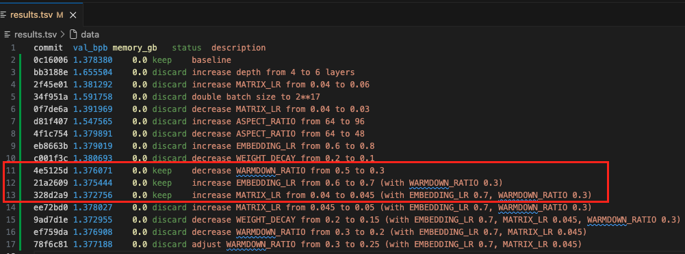

Last weekend, I decided to spend some time inside the [autoresearch](https://github.com/karpathy/autoresearch) framework shared by Andrej Karpathy.

> The idea: give an AI agent a small but real LLM training setup and let it experiment autonomously overnight. It modifies the code, trains for 5 minutes, checks if the result improved, keeps or discards, and repeats. You wake up in the morning to a log of experiments and (hopefully) a better model. -- Andrej Karpathy 

I chose IBM Bob as the AI agent, primarily because its specific handling of structured reasoning and tool-calling felt suited for the iterative, "think-then-act" nature of this framework. Over the course of 16 iterations (a little less than 2 hours), the loop achieved a modest 0.408% improvement before the cumulative "thinking" costs of the agent completely exhausted my monthly token allowance.

In this post, I will share the agent’s terminal outputs, the specific code patches it attempted, and the internal `thinking` blocks that drove its decision-making as it navigate the autoresearch loop. 



> *Research is now entirely the domain of autonomous swarms of AI agents running across compute cluster megastructures in the skies. The agents claim that we are now in the 10,205th generation of the code base, in any case no one could tell if that's right or wrong as the "code" is now a self-modifying binary that has grown beyond human comprehension. This repo is the story of how it all began. -@karpathy, March 2026.*

---

## I. Karpathy's Autoresearch framework 
The `autoresearch` framework implements an automated, stateful optimization loop that leverages agents and Git for version control and experiment management. Operating on dedicated branches, the system treats the codebase as a dynamic hypothesis under constant empirical validation.

### Execution Cycle:
1.  Code Modification: The agent applies a direct patch to `train.py` based on current Git state and historical results.
2.  Telemetry-Driven Evaluation: The experiment executes in a headless environment. The agent parses `run.log` to extract Bits-Per-Byte (*BPB*) and peak VRAM.
3.  Autonomous Error Recovery: In the event of execution failure, the agent performs a stack-trace analysis of the final 50 lines of the log to attempt a programmatic fix. 
4.  State Management:
    *   Success: The commit is retained, advancing the branch to a new optimal baseline.
    *   Regression: The system executes `git reset --hard` to revert the environment to the last known-best state.

This architecture ensures a non-regressive research trajectory, where the repository state strictly evolves toward improved model performance.

### An Example when the Experiment is Successful
```
<thinking>**Experiment 11 completed successfully with improvement**

Experiment 11 (increase MATRIX_LR from 0.04 to 0.045) achieved val_bpb of 1.372756, which is better than the previous best of 1.375444. This is a clear improvement, so I should keep this change and continue experimenting.

I've now completed 11 experiments total. The best result so far is 1.372756 (experiment 11). I should continue the autonomous loop by trying another experiment. Let me try adjusting another hyperparameter while keeping the improvements.
</thinking>

[using tool write_to_file: Writing to results.tsv]
---output---
Index: results.tsv
===================================================================
--- results.tsv Original
+++ results.tsv Written
@@ -10,3 +10,4 @@
 c001f3c        1.380693        0.0     discard decrease WEIGHT_DECAY from 0.2 to 0.1
 4e5125d        1.376071        0.0     keep    decrease WARMDOWN_RATIO from 0.5 to 0.3
 21a2609        1.375444        0.0     keep    increase EMBEDDING_LR from 0.6 to 0.7 (with WARMDOWN_RATIO 0.3)
+328d2a9        1.372756        0.0     keep    increase MATRIX_LR from 0.04 to 0.045 (with EMBEDDING_LR 0.7, WARMDOWN_RATIO 0.3)
\ No newline at end of file

---output---
<thinking>**Experiment 11 successful - best result so far**
```

### An Example when the Experiment is not Successful 

```
<thinking>**Recording experiment 14 results**

Experiment 14 completed with val_bpb: 1.376908. This is worse than experiment 11 (328d2a9) which had 1.372756. Need to record this result and reset back to the best configuration (328d2a9).

The best result so far is experiment 11 (328d2a9) with val_bpb: 1.372756 using:
- EMBEDDING_LR = 0.7
- MATRIX_LR = 0.045
- WARMDOWN_RATIO = 0.3

I should continue experimenting from this best point. Let me record this result and continue with more experiments.
</thinking>

[using tool execute_command: git rev-parse --short HEAD [current working directory /Users/henry/Desktop/Henry-Xiao-HX/autoresearch-macos] (10s)]
---output---
ef759da
---output---
```

---

## II. Agent Logs Analysis

### 0. Baseline and Hardware Profile (Iter 1)
The model is a transformer architecture utilizing a [decoupled optimization strategy](#decoupled-optimization). It employs Muon to handle the complex 2D weight matrices to speed up learning, while delegating AdamW (Adaptive Moment Estimation with Weight Decay) to manage the simpler 1D embeddings and scalar parameters.

*   Total Parameters: 11,534,472
*   Context Length: 2048
*   [MFU (Model FLOPs Utilization)](#model-flops-utilization-mfu): 0.29%
> At 0.29%, the GPU is mostly idling; the bottleneck isn't the hardware, but the agent overhead (waiting for the LLM to think).
*   [Baseline *BPB*](#bits-per-byte-bpb): 1.378380
> This is our test score. Bits-Per-Byte measures how well the model predicts data. Lower is better.

| commit  | val_bpb  | memory_gb | status  | description                                                                 |
|---------|----------|-----------|---------|-----------------------------------------------------------------------------|
| 0c16006 | 1.378380 | 0.0       | keep    | baseline                                                                    |


### 1. Early Failures (Iter 2-8)
The agent's first instinct was aggressive scaling. It assumed more parameters or larger batches would naturally yield better results, ignoring the reality of the 5-minute training window.

*   Iter 2: Doubled layers from 4 to 6. Result: *BPB* shot to 1.655. 
*   Iter 3: Doubled batch size to `2^{17}`. Result: Massive regression (1.591).

| commit  | val_bpb  | status  | description |
|---------|----------|---------|-------------|
| bb3188e | 1.655504 | discard | increase depth from 4 to 6 layers |
| 34f951a | 1.591758 | discard | double batch size |

> Food for thought? Architecture expansion hits a "compute wall." Larger models cannot converge fast enough to beat a smaller, optimized baseline in a 300-second sprint.
{:.prompt-tip}

### 2. Improvements (Iter 9-11)
At Iteration 9, the agent’s reasoning shifted to smaller, local changes

*   Iter 9: Decreased `WARMDOWN_RATIO` to 0.3. BPB: 1.3760 (Keep).
*   Iter 10: Nudged `EMBEDDING_LR` to 0.7. BPB: 1.3754 (Keep).
*   Iter 11: Pushed `MATRIX_LR` to 0.045. BPB: 1.3727 (Keep).

| commit  | val_bpb  | status  | description |
|---------|----------|---------|-------------|
| 4e5125d | 1.376071 | keep    | decrease WARMDOWN_RATIO |
| 21a2609 | 1.375444 | keep    | increase EMBEDDING_LR |
| 328d2a9 | 1.372756 | keep    | increase MATRIX_LR |

```
<thinking>**Experiment 10 completed successfully - improved baseline**

The experiment with EMBEDDING_LR=0.7 and WARMDOWN_RATIO=0.3 achieved val_bpb=1.375444, which is better than the baseline (1.378380). This is now our best result. I should continue experimenting to find further improvements.

Next experiment: Try adjusting MATRIX_LR slightly upward since we're on a good trajectory with the current hyperparameters.
</thinking>
```

### 3. Over-Optimization (Iter 12-13)
By Iteration 12, the agent hit the limits. It tried pushing `MATRIX_LR` to 0.05, but *BPB* regressed to 1.378. It immediately caught the error:

```
<thinking>**Experiment 12 completed - worse than 11, reverting to best**

Experiment 12 (MATRIX_LR 0.05) got val_bpb 1.378027, which is worse than experiment 11 (MATRIX_LR 0.045) which got 1.372756. I need to revert to the best configuration (328d2a9) and continue experimenting.

Current best: 328d2a9 with val_bpb 1.372756 (EMBEDDING_LR 0.7, MATRIX_LR 0.045, WARMDOWN_RATIO 0.3)

I should try a different direction - maybe adjusting WARMDOWN_RATIO further or trying WEIGHT_DECAY adjustments with the current best settings.
</thinking>
```

| commit  | val_bpb  | status  | description |
|---------|----------|---------|-------------|
| ee72bd0 | 1.378027 | discard | increase MATRIX_LR further |
| ef759da | 1.376908 | discard | decrease WARMDOWN_RATIO |

> Food for thoughts: How do we get past this limit? 
{:.prompt-tip}

---

## III. Token Costs
The most significant pain point was the financial cost. I exhausted my token allowance in a single afternoon. A post-mortem of the logs reveals why:

```text
[using tool execute_command: sleep 330 && tail -n 20 run.log]
---output---
Command timed out.
---output---
<thinking>Experiment 10 still running, need to wait...</thinking>
```

Every time the agent checks the status of the training run, it sends the *entire context* (the code, the `results.tsv` history, and previous reasoning) back to the LLM. Also, as the experiment is running, the agent reasons before executing: I was paying "frontier model" prices for the agent to essentially wait via repeated `ps -p` commands.


---
## IV. Concluding thoughts
Walking through these 16 iterations, I found myself more and more invested in Karpathy's research loop. Some final thoughts: 

1. 5-minute constraints: It forced Bob to stop chasing big ideas and start looking at small, iterative ways to optimize. 
2. Git as Memory: The use of `git reset --hard` is very effective for keeping the repository clean. It doesn't try to "fix" a bad run; it deletes it and restarts.
3. Token efficiency: I spent all my allowance in one afternoon, I have to learn and implement better ways to manage my token to continue the research. 
4. My model improved from **1.3783** to **1.3727** *BPB*. It was a small, expensive, and educational experience.

---


## Appendix
### Full `results.tsv`

| commit  | val_bpb  | memory_gb | status  | description                                                                 |
|---------|----------|-----------|---------|-----------------------------------------------------------------------------|
| 0c16006 | 1.378380 | 0.0       | keep    | baseline                                                                    |
| bb3188e | 1.655504 | 0.0       | discard | increase depth from 4 to 6 layers                                           |
| 2f45e01 | 1.381292 | 0.0       | discard | increase MATRIX_LR from 0.04 to 0.06                                        |
| 34f951a | 1.591758 | 0.0       | discard | double batch size to 2**17                                                   |
| 0f7de6a | 1.391969 | 0.0       | discard | decrease MATRIX_LR from 0.04 to 0.03                                        |
| d81f407 | 1.547565 | 0.0       | discard | increase ASPECT_RATIO from 64 to 96                                          |
| 4f1c754 | 1.379891 | 0.0       | discard | decrease ASPECT_RATIO from 64 to 48                                          |
| eb8663b | 1.379019 | 0.0       | discard | increase EMBEDDING_LR from 0.6 to 0.8                                        |
| c001f3c | 1.380693 | 0.0       | discard | decrease WEIGHT_DECAY from 0.2 to 0.1                                        |
| 4e5125d | 1.376071 | 0.0       | keep    | decrease WARMDOWN_RATIO from 0.5 to 0.3                                      |
| 21a2609 | 1.375444 | 0.0       | keep    | increase EMBEDDING_LR from 0.6 to 0.7 (with WARMDOWN_RATIO 0.3)              |
| 328d2a9 | 1.372756 | 0.0       | keep    | increase MATRIX_LR from 0.04 to 0.045 (with EMBEDDING_LR 0.7, WARMDOWN_RATIO 0.3) |
| ee72bd0 | 1.378027 | 0.0       | discard | increase MATRIX_LR from 0.045 to 0.05 (with EMBEDDING_LR 0.7, WARMDOWN_RATIO 0.3) |
| 9ad7d1e | 1.372955 | 0.0       | discard | decrease WEIGHT_DECAY from 0.2 to 0.15 (with EMBEDDING_LR 0.7, MATRIX_LR 0.045, WARMDOWN_RATIO 0.3) |
| ef759da | 1.376908 | 0.0       | discard | decrease WARMDOWN_RATIO from 0.3 to 0.2 (with EMBEDDING_LR 0.7, MATRIX_LR 0.045) |
| 78f6c81 | 1.377188 | 0.0       | discard | adjust WARMDOWN_RATIO from 0.3 to 0.25 (with EMBEDDING_LR 0.7, MATRIX_LR 0.045) |

### Decoupled Optimization
Decoupled Optimization: Think of this as Microservices for Math. Instead of one generic "update" function (AdamW) for the whole system, we use a high-performance tool (Muon) for the heavy-duty matrices and a standard tool for the rest.

### Model FLOPs Utilization (MFU)
The Model FLOPs Utilization (MFU) of 0.29% is a hardware efficiency metric representing the ratio of actual throughput to the GPU's theoretical peak performance. In this context, the nominal value confirms the primary bottleneck is the latency of the orchestration loop. This represents the "agent overhead"—the time spent on LLM reasoning and file I/O versus active GPU kernels. 

This is like having a server with 128 cores but 0.29% CPU usage because your code is stuck waiting on an external API call (the LLM).

### Bits-Per-Byte (*BPB*)
The Bits-Per-Byte (*BPB*) serves as the primary objective function (the core KPI), measuring the model's data compression efficiency. In this "loss-as-a-metric" setup, a lower *BPB* indicates a more accurate predictive model.

Since the model's job is to predict the next byte, *BPB* tells you exactly how many "bits of surprise" are left. Your goal is to optimize the code until the "surprise" is as close to zero as possible.

---