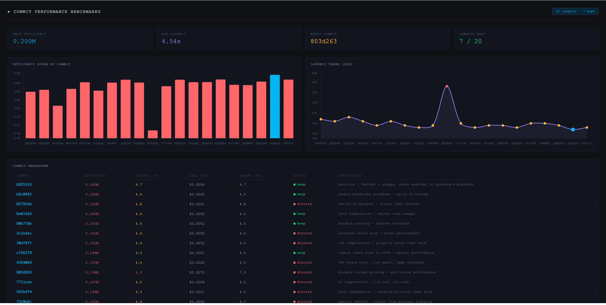

This article documents a technical experiment applying Andrej Karpathy's Autoresearch methodology, originally designed for ML model optimization, to data engineering pipeline. The project explores how an autonomous agent (IBM Bob) can optimize data pipelines by navigating the trade-offs between speed, cloud cost, and resource utilization. You can try out this project yourself at [Getting Started](#getting-started) or skip to the [Experiment Results](#experiment-results)



---

## The Framework Architecture

The experiment is built on a contract that isolates the agent’s creative freedom from the evaluation logic. This ensures that the agent can iterate rapidly without compromising the integrity of the benchmarking environment.

1.  **`Program.md`:** Defines the environment, including the dataset (1M record synthetic sample) and the tooling (e.g., `uv` for dependency management).
2.  **`baseline_config.py`:** A read-only file containing the scoring logic, dataset paths, and a fixed 5-minute time budget. The agent cannot modify this file, preventing "cheating" or metric manipulation.
3.  **`pipeline.py`:** The only file the agent is permitted to edit. It contains the logic for data pipeline, including data layout(partitioning keys, bucket counts, and sort orders), storage format compression technique, and query logic, etc.


---

## The Optimization Loop

The agent operates in a continuous cycle, utilizing Git to manage state and record progress:

1.  **Mutation:** The agent modifies a specific infrastructure lever in `pipeline.py`.
2.  **Benchmarking:** The pipeline is executed for a maximum 5 minutes.
3.  **Scoring:** An efficiency score is calculated using the following objective function:
    ```
    efficiency_score = w1 * (1/latency_seconds) + w2 * (1/cost_dollars) + w3 * resource_health_score
    ```
    Where:
    - **latency_seconds**: Total query execution time (lower is better)
    - **cost_dollars**: Cloud compute/storage cost for the run (lower is better)
    - **resource_health_score**: 0-100 metric based on memory/CPU utilization (higher is better, penalizes OOM or thrashing)
4.  **Decision:**
    * **Keep:** If the score increases, the change is committed.
    * **Discard:** If the score decreases or the script crashes, the branch is reset via `git reset --hard`.

### Experiments
The agent can experiment with:
* Data Layout: Partitioning keys, bucket counts, and sort orders.
* Storage Formats: Toggling between Parquet, ORC, Avro, or Feather.
* Query Logic: Adjusting join strategies and predicate pushdown.
* Resource Allocation: Tuning memory fractions and parallelism levels.

Or any code in `pipeline.py` where it thinks can improve the performance. 

---

## Getting Started
#### 1. Clone the repository 
```bash
git clone https://github.com/Henry-Xiao-HX/auto-data-pipeline-optimization.git
```

#### 2. Install dependencies

```bash
#Install uv if you don't have it
curl -LsSf https://astral.sh/uv/install.sh | sh
#Install project dependencies
uv sync
```

#### 3. Generate baseline dataset 
```bash
#Generate 1G synthetic dataset (~20M records)
uv run python generate_dataset.py
```
This command creates: 
- `~/.cache/auto-data/data/data.parquet` - Main dataset (Parquet with snappy compression)
- `~/.cache/auto-data/data/data.csv` - CSV version for comparison
- `~/.cache/auto-data/data/data.feather` - Feather version for comparison
- `~/.cache/auto-data/data/partitioned/` - Pre-partitioned versions for testing

#### 4. Run baseline to verify set up
```bash
uv run pipeline.py
```
Example output: 
```bash
================================================================================
INFRASTRUCTURE OPTIMIZATION EXPERIMENT
================================================================================

Configuration:
  File Format:        parquet
  Compression:        snappy
  Partition Columns:  None
  Column Pruning:     True
  Predicate Pushdown: True
  Cache Intermediate: False
  Chunk Size:         100,000

Dataset Directory:  /Users/you/.cache/autoinfra/data
Time Budget:        300s
================================================================================

Running pipeline...

Total execution time: 2.3s

---
efficiency_score:     0.8542
latency_seconds:      2.1
cost_dollars:         0.0012
resource_health:      87.5
throughput_mb_s:      48.2
data_processed_gb:    0.1
peak_memory_gb:       0.8
cpu_utilization_pct:  65.3
data_correct:         True

================================================================================
EXPERIMENT COMPLETED SUCCESSFULLY
================================================================================

```

#### 5. Start Autonomous Optimization
Point your AI agent (Claude, IBM Bob, etc.) to infrastructure_program.md and let it run. 
```
Hi, have a look at infrastructure_program.md and let's kick off a new experiment! Let's do the setup first.
```
The agent will:

- Try different configurations
- Keep improvements, discard regressions
- Log all results to infra_results.tsv


## Experiment Results

Below is the execution log (`infra_results.tsv`) from a recent trial run. The agent performed 20 experiments before I stopped its execution, netting a 11.3% improvement from baseline efficiency. 

| commit | efficiency_score | latency_sec | cost_usd | memory_gb | status | description |
| :--- | :--- | :--- | :--- | :--- | :--- | :--- |
| b855524 | 179936.8891 | 4.7 | 0.0056 | 4.7 | **keep** | baseline - feather + snappy, cache enabled, no predicate pushdown |
| b6c0992 | 182233.8009 | 4.6 | 0.0055 | 4.5 | **keep** | enable predicate pushdown - early filtering |
| 02792de | 163251.8696 | 4.8 | 0.0061 | 4.8 | discard | switch to parquet - slower than feather |
| 6e014d3 | 183373.9876 | 4.6 | 0.0055 | 4.5 | **keep** | zstd compression - better than snappy |
| 80677de | 191276.4190 | 4.4 | 0.0052 | 4.5 | **keep** | disable caching - reduces overhead |
| 3c2e4ac | 181245.1206 | 4.6 | 0.0055 | 4.5 | discard | increase chunk size - worse performance |
| 30df87f | 190899.4804 | 4.4 | 0.0052 | 4.5 | discard | lz4 compression - slightly worse than zstd |
| cf26279 | 194354.6490 | 4.3 | 0.0051 | 4.5 | **keep** | reduce chunk size to 100k - better performance |
| 4359064 | 190961.5426 | 4.4 | 0.0052 | 4.5 | discard | 50k chunk size - too small, adds overhead |
| 803d263 | 133771.6668 | 6.3 | 0.0075 | 7.3 | discard | disable column pruning - much worse performance |
| 7711cee | 186564.4094 | 4.5 | 0.0054 | 4.5 | discard | no compression - I/O cost too high |
| 592b474 | 194316.2414 | 4.3 | 0.0051 | 4.5 | discard | gzip compression - marginally worse than zstd |
| 73c0e6c | 191355.4304 | 4.4 | 0.0052 | 4.7 | discard | query() method - slower than boolean indexing |
| 860bbfd | 191513.1058 | 4.4 | 0.0052 | 3.8 | discard | categorical dtype - conversion overhead outweighs benefits |
| e55588d | 194628.1254 | 4.3 | 0.0051 | 4.5 | **keep** | named aggregations - avoid MultiIndex flattening |
| e71c067 | 188208.7126 | 4.5 | 0.0053 | 4.5 | discard | lower memory limit - no benefit |
| a588867 | 187918.2632 | 4.5 | 0.0053 | 4.6 | discard | sort=False in groupby - worse performance |
| d0bb26d | 192083.8743 | 4.4 | 0.0052 | 4.5 | discard | 75k chunk size - worse than 100k |
| e7e5ac5 | 200173.7765 | 4.2 | 0.0050 | 4.5 | **keep** | remove copy() calls - major improvement |
| b461c1c | 194498.0399 | 4.3 | 0.0051 | 4.5 | discard | inplace operations - slower than chaining |

---

### Core Performance Improvements

| Milestone | Commit | Efficiency | Δ Baseline | Key Change |
| :--- | :--- | :--- | :--- | :--- |
| Baseline | `b855524` | 179,936.89 | — | Feather + Snappy, Caching On |
| I/O Refinement | `6e014d3` | 183,373.99 | +1.9% | Switched to zstd compression |
| Logic Tuning | `80677de` | 191,276.42 | +6.3% | Disabled caching to reduce overhead |
| Chunking | `cf26279` | 194,354.65 | +8.0% | Optimized to 100k row chunks |
| Final State | `e7e5ac5` | 200,173.78 | +11.3% | Removed redundant `.copy()` calls |

---

### Technical Observations
The optimization loop demonstrated that for this specific workload, standard "best practices" often introduced more overhead than they resolved. A breakdown of the logic during key iterations:

1.  Format Selection: Early testing identified that Parquet (`02792de`) was suboptimal for this dataset size, leading to a focus on Feather.
2.  Overhead Reduction: The search identified that features like intermediate caching (`80677de`) added serialization penalties that exceeded re-computation costs.
3.  Refinement: Fine-tuning memory via 100k chunk sizes (`cf26279`) balanced CPU utilization and I/O throughput.

By the final commit (`e7e5ac5`), the pipeline was simplified, maximizing the throughput-to-cost ratio.

---

### Key Findings

#### 1. Memory and Object Management
The most significant gain resulted from removing unnecessary defensive copies. Minimizing memory allocation reduced latency from 4.7s to 4.2s and dropped per-unit cost to $0.0050. Notably, attempts to use `inplace=True` (`b461c1c`) and categorical dtypes (`860bbfd`) regressed performance due to engine-level conversion overhead.

#### 2. Storage & I/O
Testing confirmed that for this workload, Feather outperforms Parquet (`02792de`), which saw a ~9.2% drop in efficiency. While Snappy is common, zstd provided a superior balance of compression ratio and decompression speed for our specific throughput requirements.

#### 3. Counter-Intuitive Regressions
* Caching: Disabling the intermediate cache (`80677de`) provided a +4.3% boost, as the transformation logic proved faster than the I/O penalty of serialized caching.
* Column Pruning: Disabling pruning (`803d263`) caused the most severe regression, with efficiency dropping by 25.6% and memory usage spiking to 7.3GB.

### Final Configuration
* Format: Feather (zstd compression)
* Granularity: 100k row chunks
* Logic: Boolean indexing (avoiding `.query()`), named aggregations, and method chaining to minimize memory fragmentation.

---

## Final thoughts
* Complexity vs. Gain: The experiment utilizes a "Simplicity Criterion." If an optimization adds significant code complexity for a marginal gain, it is discarded.
* Shift in Responsibility: The human role shifts from writing manual configurations to defining the weights of the objective function. The effort is spent on ensuring the evaluation harness (`baseline_config.py`) is robust.
* Environment Specificity: The results suggest that "optimal" configurations are highly dependent on the dataset and hardware. A configuration that wins on a 100MB dataset may not hold at 100TB.

This framework is still in the experimental phase, but early results indicate that the "Research Loop" is a viable method for automating the more repetitive aspects of infrastructure tuning.

## Appendix 
Using synthetically generated data. 
