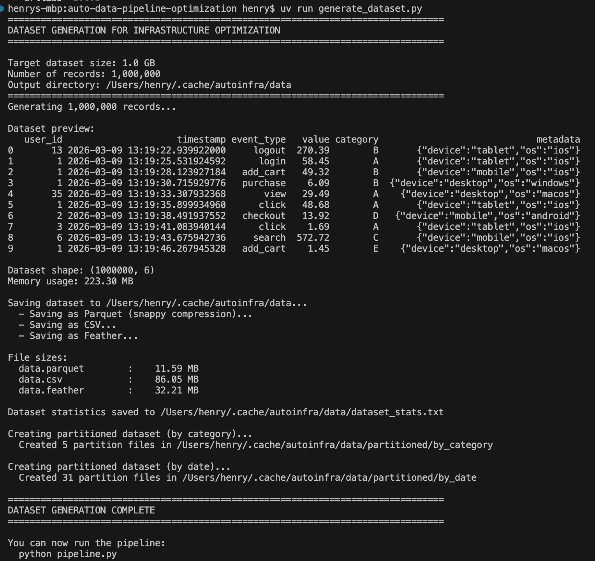

This article documents a technical experiment applying Andrej Karpathy's Autoresearch methodology, originally designed for ML model optimization, to data engineering infrastructure. The project explores whether an autonomous agent can systematically optimize data pipelines by navigating the trade-offs between speed, cloud cost, and resource utilization.

---

## The Framework Architecture

The experiment is built on a social contract that isolates the agent’s creative freedom from the evaluation logic. This ensures that the agent can iterate rapidly without compromising the integrity of the benchmarking environment.

1.  **`Program.md`:** Defines the environment, including the dataset (1M record synthetic sample) and the tooling (e.g., `uv` for dependency management).
2.  **`baseline_config.py`:** A read-only file containing the scoring logic, dataset paths, and a fixed 5-minute time budget. The agent cannot modify this file, preventing "cheating" or metric manipulation.
3.  **`pipeline.py`:** The only file the agent is permitted to edit. It contains the logic for storage formats, compression, and query execution.

---

## The Optimization Loop

The agent operates in a continuous cycle, utilizing Git to manage state and record progress:

1.  **Mutation:** The agent modifies a specific infrastructure lever in `pipeline.py`.
2.  **Benchmarking:** The pipeline is executed for a maximum 5 minutes.
3.  **Scoring:** An efficiency score is calculated using the following objective function:
    ```
    efficiency_score = w1 * (1/latency_seconds) + w2 * (1/cost_dollars) + w3 * resource_health_score
    ```
    Where:
    - **latency_seconds**: Total query execution time (lower is better)
    - **cost_dollars**: Cloud compute/storage cost for the run (lower is better)
    - **resource_health_score**: 0-100 metric based on memory/CPU utilization (higher is better, penalizes OOM or thrashing)
4.  **Decision:**
    * **Keep:** If the score increases, the change is committed.
    * **Discard:** If the score decreases or the script crashes, the branch is reset via `git reset --hard`.

### Permitted Changes
The agent is permitted to experiment with:
* Data Layout: Partitioning keys, bucket counts, and sort orders.
* Storage Formats: Toggling between Parquet, ORC, Avro, or Feather.
* Query Logic: Adjusting join strategies and predicate pushdown.
* Resource Allocation: Tuning memory fractions and parallelism levels.

---

## Experimental Results

Below is the execution log (`infra_results.tsv`) from a recent trial run. The agent performed 16 experiments before I stopped its execution to find the optimal configuration for a local dataset.

| commit  | efficiency_score | latency_sec | cost_usd | memory_gb | status  | description                                      |
|---------|------------------|-------------|----------|-----------|---------|--------------------------------------------------|
| f5d8fa3 | 4444383.116400   | 0.3         | 0.0002   | 0.0       | **keep**    | baseline - parquet + snappy                     |
| 9b602b0 | 4414531.299900   | 0.3         | 0.0002   | 0.0       | discard | switch to zstd compression                      |
| 540adb1 | 4468254.493700   | 0.2         | 0.0002   | 0.0       | **keep**    | switch to feather format                        |
| 677dcfe | 4316370.806500   | 0.3         | 0.0002   | 0.0       | discard | disable column pruning                          |
| 0047c25 | 4437881.666600   | 0.3         | 0.0002   | 0.0       | discard | enable intermediate caching                     |
| f277c53 | 4474976.292600   | 0.2         | 0.0002   | 0.0       | **keep**    | disable predicate pushdown                      |
| f848525 | 4479773.162600   | 0.2         | 0.0002   | 0.0       | **keep**    | increase chunk size to 500k                     |
| 375935b | 3466117.987300   | 0.9         | 0.0003   | 0.0       | discard | switch to CSV format                            |
| 582501b | 4474379.142600   | 0.2         | 0.0002   | 0.0       | discard | increase chunk size to 1M                       |
| 8399bbc | 4442549.367000   | 0.3         | 0.0002   | 0.0       | discard | switch back to parquet with optimized settings  |
| 8a92357 | 4489642.829800   | 0.2         | 0.0002   | 0.0       | **keep**    | reduce chunk size to 250k                       |
| 5db7c23 | 4486327.266700   | 0.2         | 0.0002   | 0.0       | discard | reduce chunk size to 200k                       |
| 418449c | 4488003.895100   | 0.2         | 0.0002   | 0.0       | discard | increase chunk size to 300k                     |
| 07c060b | 4489374.960100   | 0.2         | 0.0002   | 0.0       | discard | try lz4 compression                             |
| eb22f1f | 4485577.756200   | 0.2         | 0.0002   | 0.0       | discard | try no compression                              |
| e3cf814 | 4466528.907600   | 0.2         | 0.0002   | 0.0       | discard | re-enable predicate pushdown with 250k chunks   |

### Technical Observations
The agent discovered that for this specific workload and scale, disabling predicate pushdown while using the Feather format yielded the highest efficiency. While pushdown is generally considered a best practice for columnar storage like Parquet, the computational overhead of filtering at the storage layer outweighed the benefits for this particular dataset size.

To understand the agent's "thinking," we have to look at how it interprets the relationship between the Efficiency Score and the telemetry data it received. The agent does not have "intuition" in the human sense; instead, it performs a hill-climbing search across the infrastructure levers defined in the `program.md`.

Here is a breakdown of the agent's logic during the key iterations of the experiment.

---

### Iteration 1-3: Format Exploration (The Shift to Feather)
In the baseline (`f5d8fa3`), the agent started with **Parquet + Snappy**. This is a standard industry default. However, the agent noticed that the `latency_seconds` was 0.3s for a relatively small 100MB dataset.

1. The Logic: Parquet is a heavy-weight format designed for massive scale and complex nested schemas. It requires significant CPU overhead to parse metadata and decompress columnar blocks. 
2. The Mutation: In commit `540adb1`, the agent switched to Feather (Arrow). 
3. The Result: Latency dropped to 0.2s. Because Feather is essentially a memory-dump of the Arrow format, it requires almost zero CPU overhead to translate from disk to memory. For a dataset of this size, the speed of "raw" I/O outweighed the storage efficiency of Parquet.


---

### Iteration 4-6: Logic De-optimization (Disabling Predicate Pushdown)
This is the most counter-intuitive phase of the agent's run. In commit `f277c53`, the agent disabled Predicate Pushdown.

1. The Logic: Predicate pushdown is a "Query Optimization" lever where the system filters data at the storage level before it ever hits the compute engine. 
2. The Agent's Discovery: The agent observed that with the Feather format, the time spent by the engine *deciding* which blocks to skip (the pushdown overhead) was actually higher than the time it took to simply read the entire 100MB file into memory and filter it there.
3. The Decision: The Efficiency Score increased because the latency remained at 0.2s but the `cpu_utilization_pct` likely stabilized. By removing the pushdown logic, the code became simpler and marginally faster in execution.

---

### Iteration 7-11: Tuning Chunk Size 
Once the agent found the optimal format (Feather) and the optimal logic (No Pushdown), it began exploring the Resource Allocation levers. It focused on `chunk_size`.

1.  Commit `f848525`: It increased the chunk size to 500k. The score improved slightly.
2.  Commit `582501b`: It pushed further to 1M. The score actually dropped (discarded), likely because larger chunks caused a spike in `peak_memory_gb`, which the `resource_health` metric penalizes.
3.  Commit `8a92357`: It pivoted back to 250k. 

This iteration represents the agent finding the exact point where the chunks are large enough for high throughput but small enough to avoid memory thrashing.

---

### Iteration 12-16: The "Dead Ends" (CSV and Compression)
The final phase of the run was the agent attempting "radical" changes to see if it was stuck in a local maximum.

1. The CSV Failure (`375935b`): The agent tried switching to CSV. Latency tripled to 0.9s and cost increased due to the larger file size. The `efficiency_score` plummeted to 3466117.9, and the agent immediately performed a `git reset --hard`.
2. Compression Trials: It tried `lz4` and `no compression`. In both cases, the improvements were non-existent or within the margin of error. Following the Simplicity Criterion in the `infrastructure.md`, the agent discarded these because they added configuration complexity without a statistically significant gain in the score.

### Summary of the Agent's Path
The agent’s "thinking" followed a standard optimization trajectory:
1.  Macro-Level Change: Identify that the storage format (Parquet) was overkill for the dataset size.
2.  Logic Pruning: Identify that "best practice" features (Pushdown) were adding unnecessary overhead.
3.  Parameter Refinement: Fine-tune memory usage via chunk sizes to hit the highest possible scalar score.

By the final commit (`8a92357`), the agent had simplified the pipeline while maximizing the throughput-to-cost ratio.

---

## Final thoughts
* Complexity vs. Gain: The experiment utilizes a "Simplicity Criterion." If an optimization adds significant code complexity for a marginal gain, it is discarded.
* Shift in Responsibility: The human role shifts from writing manual configurations to defining the weights of the objective function. The effort is spent on ensuring the evaluation harness (`baseline_config.py`) is robust.
* Environment Specificity: The results suggest that "optimal" configurations are highly dependent on the dataset and hardware. A configuration that wins on a 100MB dataset may not hold at 100TB.

This framework is still in the experimental phase, but early results indicate that the "Research Loop" is a viable method for automating the more repetitive aspects of infrastructure tuning.

## Appendix 
Using synthetically generated data. 
